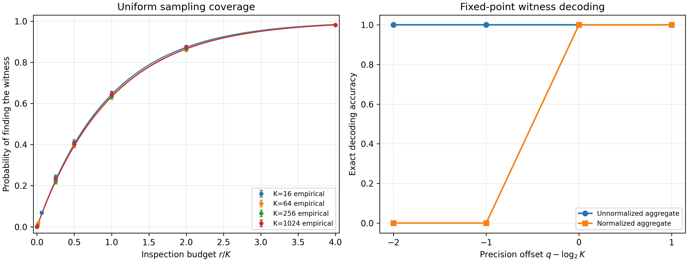

# Finite-Precision Continuous-CoT Experiment Harness


## Implemented experiments

### Hybrid frontier retrieval

The encoder sees a uniformly random bit frontier `S`, creates a hard finite
state and/or hard categorical transcript, and then the prefix is sealed. The
decoder receives only the retained summary and an independent query `V`.
By default training evaluates all legal membership queries for each encoded
frontier (the prefix is encoded once); evaluation still uses an independent
uniform query. Set `train_all_queries: false` for single-query supervision.

```bash
python experiments/run_finite_cot.py args/finite_cot/frontier_capacity.yaml
python experiments/run_sweep.py args/finite_cot/frontier_sweep.yaml \
  --output results/finite_cot/frontier_sweep.jsonl
python experiments/run_finite_cot.py args/finite_cot/frontier_learned.yaml
```

`frontier_capacity.yaml` and the sweep use `fixed_hybrid`, an explicit packing
construction that cleanly checks the predicted total-bit threshold. The
`frontier_learned.yaml` run asks whether optimization discovers a useful code;
do not merge these evidence types. For equal retained budgets, compare
latent-only, transcript-only, and hybrid settings. Run `model: unquantized` and
`model: prefix_reread` only as controls; their ledgers explicitly mark them as
outside the finite-state bound.

### Graph reachability (Boolean BFS)

`boolean_bfs` checks the Boolean recurrence that retains every vertex reachable
from a source within the current update depth. The deterministic mechanism
check compares it with an independent, queue-based, limited-depth BFS on the
full 81-configuration grid used in the paper:

- graph sizes: `32`, `64`, and `128`;
- directed-edge probabilities: `0.02`, `0.05`, and `0.10`;
- propagation depths: `4`, `8`, and `16`;
- random seeds: `17`, `42`, and `137`.

The current check obtains exact agreement in all `81/81` configurations and on
all `6,048/6,048` vertex-level reachability decisions, giving decision accuracy
`1.0` and full reachable-vector agreement `1.0`. When a mismatch occurs, the
JSON output records its graph size, edge probability, depth, seed, and number
of mismatched vertices.

The regression test also uses small directed graphs to catch errors that random
graphs can hide: reversed adjacency orientation, off-by-one propagation,
failure to retain previously reached vertices, incorrect handling of cycles or
disconnected vertices, and incorrect batching of graphs and sources.

```bash
python experiments/run_mechanism_checks.py \
  --output results/finite_cot/mechanism_checks.json
python -m unittest discover -s tests -p 'test_boolean_bfs.py' -v
```

### Pointer chasing

`LearnedPointerMachine` carries a hard `d`-coordinate, `p`-bit state and may
make exactly one hard query to `f` per update. Training may use the cached path
for teacher-forced query selection and intermediate-state supervision;
evaluation uses the model's hard decoded query.

```bash
python experiments/run_finite_cot.py args/finite_cot/pointer_depth.yaml
```

Sweep capacity with `updates >= depth`, then sweep updates with enough state.
`BinaryPointerMachine` is the imposed-code construction check; it is not learned
evidence.

### Rare witness

The rare-witness experiment separates three mechanisms. Uniform sampling can
observe only explicitly inspected markers; exhaustive scan reads all `K`
markers; and hypercube aggregation reads all markers, performs `K*d` scalar
aggregation work, and retains the witness identity in `d = log2(K)`
coordinates.

The sampling curve uses `K = 16, 64, 256, 1024` and budgets
`r = 0, 1, K/4, K/2, K, 2K, 4K`. For each `K`, 5,000 independent instances
share one sampled sequence up to `4K`, so smaller budgets are paired prefixes.
The report includes Wilson 95% binomial intervals and the exact probability
`1 - (1 - 1/K)^r`. With seed 17, the mean absolute error is `0.00341`, the
maximum is `0.01208`, and the largest standardized error is `2.04`.

Construction correctness is checked exhaustively at every witness position for
`K = 16, 64, 256, 1024, 4096`, together with `NULL` inputs and bounded
perturbations below `1/2`. A separate ties-to-even fixed-point sweep compares
the unnormalized state `c_J` with `c_J/K` at
`q - log2(K) = -2, -1, 0, 1`. The unnormalized state remains exact throughout;
the normalized state is erased for offsets `-2` and `-1` and becomes exact at
offsets `0` and `1`. This is a fixed-point resolution result, not a universal
coordinate-storage lower bound.

| Procedure | Charged branch reads | Additional work |
|-----------|---------------------:|-----------------|
| Uniform sampling | `r` | sample generation, marker checks, and decoding |
| Exhaustive scan | `K` | marker checks and witness recording |
| Hypercube aggregation | `K` | `K*d` scalar aggregation operations |



The left panel plots the probability that uniform sampling finds the unique
witness against the normalized inspection budget `r/K`. Points are empirical
results for the four candidate counts and vertical bars are Wilson 95%
binomial confidence intervals. The matching solid curves are the exact
finite-`K` probabilities `1 - (1 - 1/K)^r`. Plotting against `r/K` makes the
inverse-mass scaling visible: the curves nearly coincide, reaching about
`0.221` at `r = K/4`, `0.393` at `r = K/2`, `0.632` at `r = K`, `0.865` at
`r = 2K`, and `0.982` at `r = 4K`. Thus a constant probability of finding a
uniformly hidden witness requires a sampling budget proportional to `K`.

The right panel plots exact identity-decoding accuracy against the precision
offset `q - log2(K)`. The unnormalized aggregate has coordinates `+1` or `-1`
and remains exactly decodable at every tested precision. Normalization reduces
their magnitude to `1/K`: at offsets `-2` and `-1` they round to zero, so the
decoder returns `NULL`; at `q = log2(K)` the values become exactly
representable and accuracy jumps to `1.0`. In particular, the failure at
offset `-1` is the specified ties-to-even midpoint behavior.

Together, the panels separate three claims. Sampling needs order-`K` marker
reads for constant coverage; the `d`-coordinate hypercube state can identify
one of `2^d` witnesses after full aggregation; and an averaged state needs
enough fixed-point resolution to preserve its `1/K` signal. The figure does
not demonstrate learned reasoning or a universal storage-bit lower bound, and
direct aggregation still reads all `K` markers and performs `K*d` scalar work.

```bash
python experiments/run_finite_cot.py args/finite_cot/rare_witness.yaml \
  --output results/finite_cot/rare_witness.json
python experiments/plot_rare_witness.py results/finite_cot/rare_witness.json \
  --output rare_witness.png
python -m unittest discover -s tests -p 'test_rare_witness.py' -v
```

## Strict ProsQA adapter

The original `coconut.py` retains the prefix KV cache and every earlier latent
position. That behavior is useful as the original baseline but is not a strict
`CCoT(d,p,T)` state machine. Set `finite_state.enabled: true` to select
`StrictFiniteStateCoconut`:

```bash
torchrun --nnodes 1 --nproc_per_node 2 run.py \
  args/prosqa_finite_state_2l_8h_768d.yaml
```

`readonly_input` recomputes each update from the immutable prefix and current
hard state. `sealed_prefix` uses the prefix once to initialize the state and
then applies a state-only transition. Neither mode uses `past_key_values` or
retains the latent history. This reference implementation loops over batch
items for an easily audited boundary, so it is slower than the original model.

The original curriculum can still include a zero-latent stage. Do not report
that stage as a finite-state evaluation; evaluation examples must contain at
least one latent slot for the bottleneck to apply.

Set `pretrained_model_id` to initialize the causal LM from Hugging Face before
adding the finite-state CCoT bottleneck. This bypasses `model_id`, resizes the
language-model vocabulary to `STokenizer`, and writes the resolved Hugging Face
configuration to `<save_path>/<name>/model_config.json`. Set it to `null` to
construct random weights from the local `model_id` configuration instead.
Pretrained models are adapted with rank-4 LoRA: the original transformer is
frozen, while LoRA weights, the resized token input/output interface, and the
finite-state bottleneck remain trainable. Resumed pretrained runs must use a
checkpoint created with this LoRA topology; older full-finetuning checkpoints
are rejected with a compatibility error.

Both vocabulary and latent inputs preserve the transformer's hidden width.
Vocabulary IDs map directly to vectors of width `H`; a latent hidden vector is
projected from `H` to the finite state width `d`, hard-quantized, and expanded
from `d` back to `H`. The expanded vector occupies one sequence position next
to vocabulary embeddings. Its width is continuous, but its retained
information is still limited to the discrete `d * model_bits` code because the
expansion is a deterministic function of that code.

Set `tokenizer: stokenizer` to use the built-in symbolic tokenizer. Any other
value is treated as a Hugging Face tokenizer ID. The trainer then registers
`<|start-latent|>`, `<|end-latent|>`, and `<|latent|>` as additional special
tokens, configures right padding, resizes the model embeddings, and saves the
resolved tokenizer under `<save_path>/<name>/tokenizer/`.

### Qwen3-0.6B LoRA run

Install the pinned dependencies from `requirements.txt`, then save the
following as `args/prosqa_finite_state_qwen3_0.6b.yaml`. Qwen3 requires
Transformers 4.51 or newer; the requirements file pins a compatible release.
The native [Qwen/Qwen3-0.6B](https://huggingface.co/Qwen/Qwen3-0.6B)
tokenizer is retained and the three latent markers are added automatically.

```yaml
project: finite-cot
save_path: ckpts
name: prosqa-qwen3-0.6b-finite-state-d64-p2-readonly

only_eval: false
coconut: true
cot: false
no_thoughts: false
no_cot: false

c_thought: 1
epochs_per_stage: 25
max_latent_stage: 4
pad_latent_to_max: true

finite_state:
  enabled: true
  state_dim: 64
  model_bits: 2
  bits_per_coordinate: 2
  clip_value: 1.0
  learnable_clip: false
  access_mode: readonly_input

save_only_improve: true
save_best_only: true
uniform_prob: 0.1
model_id: configs/symbol-2layer-8head-768dim.json # bypassed for pretrained runs
pretrained_model_id: Qwen/Qwen3-0.6B
tokenizer: Qwen/Qwen3-0.6B
load_model_path: None

seed: 17
resume: 0
bf16: true
training_dtype: bfloat16
train_path: data/prosqa_train_graph_4_coconut.json
val_path: data/prosqa_valid_graph_4_coconut.json
reset_optimizer: false
batch_size_training: 2
debug: false
gradient_accumulation_steps: 64
num_epochs: 300
lr: 1.0e-4
weight_decay: 0.01
```

Launch on one GPU from the repository root:

```bash
python -m pip install -r requirements.txt
torchrun --standalone --nnodes=1 --nproc_per_node=1 run.py \
  args/prosqa_finite_state_qwen3_0.6b.yaml
```

With `save_best_only: true`, each global validation-accuracy improvement
overwrites `best_model.pt`. The best epoch within each curriculum stage is also
retained as `best_stage_<stage>.pt` and overwritten only when that stage's score
improves. For LoRA runs, these files contain only trainable weights: the LoRA
adapters, token embeddings/LM head, and finite-state modules; the frozen Qwen
base is not duplicated. The same best-only behavior can be enabled for any
config with the `--save-best-only` command-line flag.

The effective global batch size is `1 GPU * 2 examples * 64 accumulation =
128`. Reduce `batch_size_training` if memory is tight and increase
`gradient_accumulation_steps` proportionally to retain that effective batch.

### ProsQA QAT grid search

The strict finite-state quantizer uses hard quantize/dequantize operations at
`model_bits` in the forward pass and an identity straight-through gradient in
the configured floating `training_dtype`. Sweep state dimension and model
precision while holding the training dtype fixed:

```bash
python experiments/run_prosqa_grid.py args/prosqa_finite_state_grid.yaml --dry-run
python experiments/run_prosqa_grid.py args/prosqa_finite_state_grid.yaml
```

Runs execute sequentially and get independent checkpoint directories named
with `d`, model bits (`mb`), and the training dtype. Generated configs and a
JSONL manifest are written under `results/prosqa_grid/`. Existing checkpoints
are resumed by `run.py`.

## Verification

```bash
python -m unittest discover -s tests -v
python experiments/run_mechanism_checks.py
```

The mechanism-check output distinguishes vertex-level `decision_accuracy` from
whole-vector `frontier_vector_agreement`; both must equal `1.0` for the BFS
check to pass.

## MuSiQue finite-CoT

The MuSiQue runs fully fine-tune GPT-2 without LoRA and explicitly quantize only
the recurrent state. Read the complete data, token-budget, supervision, access,
and limitation record in
[proposal/MUSIQUE_FINITE_COT.md](proposal/MUSIQUE_FINITE_COT.md).

Question-conditioned finite baseline:

```bash
torchrun --standalone --nnodes=1 --nproc_per_node=1 run.py \
  args/finite_cot/musique_gpt2_question_conditioned.yaml
```

Strict read-once continuation run:

```bash
torchrun --standalone --nnodes=1 --nproc_per_node=1 run.py \
  args/finite_cot/musique_gpt2_strict_continuation.yaml
```

The same strict interface is available for ProsQA. Graph edges are consumed as
the read-once prefix; `[Q]` candidate targets and `[R]` root form the shared
post-boundary continuation used by each state update:

```bash
torchrun --standalone --nnodes=1 --nproc_per_node=1 run.py \
  args/finite_cot/prosqa_gpt2_strict_continuation.yaml
```

Dataset loaders use the shared `build_finite_continuation_prompt` formatter.
Future datasets only need to supply an evidence string, continuation string,
number of updates, and answer tail to receive the same marker contract. The
general interface and ProsQA curriculum are documented in
[proposal/FINITE_CONTINUATION_INTERFACE.md](proposal/FINITE_CONTINUATION_INTERFACE.md).

The resource-sweep launcher holds each retained budget at `B=d*p` while varying
the configured state precision and recurrent steps. Its dry run writes
auditable resolved configs and a JSONL manifest without starting training:

```bash
python experiments/run_musique_resource_sweep.py \
  args/finite_cot/musique_resource_sweep.yaml --dry-run
```

The tests verify finite alphabets and hard codes, prefix sealing, one-query
oracle enforcement, Boolean BFS, pointer capacity/depth controls, hypercube
decoding, and the no-history ProsQA adapter.

## Interpretation rules

- Deterministic BFS, binary pointer, and hypercube checks validate the
  constructions, not learnability.
- The frontier phase diagram is learned evidence for total retained-summary
  capacity only under the sealed-prefix interface.
- The learned pointer run uses intermediate path supervision; report this
  explicitly and keep answer-only training as a later, harder control.
- The hypercube result is an access-model separation. It compresses persistent
  identity but still reads all `K=2^d` markers.
- Always retain the emitted resource ledger and hard code examples with each
  result JSON.
